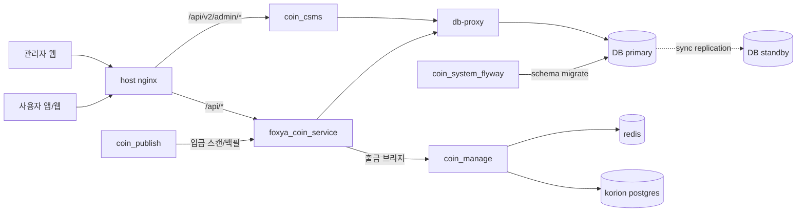

# Instance A 운영 구조

## 1. 목적

이 문서는 현재 확인된 운영 기준으로 `Instance A` 계열 코인 플랫폼 구성을 한 문서에서 정리한다.

- 앱 서비스
- 관리자/웹 프론트
- 레거시 코인 워커
- Flyway
- DB 클러스터링
- `coin_manage(korion-service)` 기반 신규 출금 서비스

## 2. 구성 요약

현재 운영 구조는 단일 프로젝트가 아니라 여러 저장소가 역할을 나눠 갖는 형태다.

- 사용자 앱 API 및 기존 비즈니스 API: `foxya_coin_service`
- 관리자/클라이언트 웹 정적 배포: `fox_coin_frontend`
- 레거시 코인 워커 및 입금 스캐너: `coin_publish`
- DB 마이그레이션: `coin_system_flyway`
- 신규 출금/원장/워커: `coin_manage`
- 관리자 백엔드 API: `coin_csms`
- 데이터 계층: `PostgreSQL primary/standby + db-proxy`

## 2.1 전체 구조도

### 2.1.1 서버/서비스 구조

```text
                                      [ 사용자 / 관리자 브라우저 / 앱 ]
                                                     |
                                                     v
                                            korion.io.kr / api.korion.io.kr
                                                     |
                                                     v
                                        +-----------------------------+
                                        | Main Server 52.200.97.155   |
                                        | private: 172.31.36.110      |
                                        +-----------------------------+
                                        | host nginx                  |
                                        | fox_coin_frontend (dist)    |
                                        | foxya_coin_service :8080    |
                                        | coin_csms :8081             |
                                        | coin_publish workers        |
                                        | coin_system_flyway          |
                                        | db-proxy :15432             |
                                        | local postgres primary      |
                                        | rabbitmq / mysql            |
                                        | prometheus / grafana        |
                                        +-----------------------------+
                                           |                |
                     admin / user api -----+                +----- db access via proxy
                                           |                                |
                                           v                                v
                                 +------------------+             +------------------+
                                 | coin_manage      |             | DB Cluster       |
                                 | 54.83.183.123    |             | primary + standby|
                                 +------------------+             +------------------+
                                 | app-api          |             | primary host     |
                                 | app-ops          |             | standby host     |
                                 | withdraw-worker  |             | synchronous repl |
                                 | postgres         |             | db-proxy entry   |
                                 | redis            |             +------------------+
                                 +------------------+
```

### 2.1.2 요청 흐름 구조



## 3. 저장소별 역할

### 3.1 `foxya_coin_service`

구현 위치

- `/Users/an/work/foxya_coin_service`

역할

- 앱 사용자 요청 진입점
- 로그인, 유저, 지갑, 구독, 입금/출금 요청 API
- 레거시 기준 `external_transfers`, `internal_transfers`, `subscriptions` 등 핵심 비즈니스 테이블 사용
- 출금 요청 시 잔액 잠금 및 `coin_manage` 브리지 호출

현재 기준

- 사용자는 여전히 `foxya_coin_service`의 `/api/v1/transfers/external`로 출금 요청
- `TRON + KORI/FOXYA` 출금은 `coin_manage`로 브리지
- 레거시 출금 재디스패치/스트림 발행은 기본 비활성

### 3.2 `fox_coin_frontend`

구현 위치

- `/var/www/fox_coin_frontend`
- 로컬 저장소는 현재 별도 정리돼 있고 운영 배포는 host nginx가 `dist`를 직접 서빙

역할

- 사용자 클라이언트 웹
- 관리자 웹 페이지
- 웹은 `korion.io.kr` same-origin `/api/*` 경로 사용

현재 기준

- 웹은 `api.korion.io.kr` 직접 호출이 아니라 `korion.io.kr/api/...` 사용으로 정리됨
- `deploy-docker.sh --auto`는 host nginx 직접 서빙 구조를 인식함

### 3.3 `coin_publish`

구현 위치

- `/Users/an/work/coin_publish`

역할

- 레거시 체인 워커
- 입금 스캔/백필
- 일부 레거시 출금/컨펌/스윕 워커 코드 보유

현재 기준

- 운영 기본값은 입금 중심
- `ENABLE_LEGACY_WITHDRAWAL_WORKERS=false`
- 출금 워커는 코드상 남아 있으나 기본 비활성

### 3.4 `coin_system_flyway`

구현 위치

- `/Users/an/work/coin_system_flyway`

역할

- 모든 운영 DB 스키마 변경 및 데이터 백필
- 테스트 데이터, 출금 브리지 컬럼, 관리자 액션 타임스탬프 등의 반영 창구

현재 기준

- 메인 서버에서 `flywayMigrate`로 운영 반영
- `external_transfers.coin_manage_withdrawal_id`까지 반영됨

### 3.5 `coin_manage`

구현 위치

- `/Users/an/work/coin_manage`
- 운영 서버: `54.83.183.123`

역할

- 신규 출금 상태머신
- 내부 원장
- 관리자 승인 후 dispatch/reconcile worker
- BullMQ 기반 출금 워커
- 입금/출금 모니터 일부 운영 기능

현재 기준

- `foxya_coin_service`에서 생성된 일부 출금 요청이 브리지로 들어옴
- 출금 최종 실행 주체로 수렴 중
- `app-api`, `app-ops`, `app-withdraw-worker`로 역할 분리

### 3.6 `coin_csms`

구현 위치

- `/Users/an/IdeaProjects/coin_csms`

역할

- 관리자 인증
- 관리자 출금/펀드/운영 API
- `korion.io.kr` 및 `api.korion.io.kr` 경유 관리자 요청 처리

현재 기준

- `/api/v2/admin/*`는 `csms-api`로 라우팅
- 관리자 로그인/대시보드 요청은 이 백엔드가 받음

## 4. 서버 배치

### 4.1 메인 서버

서버

- `52.200.97.155`
- private IP: `172.31.36.110`

주요 역할

- `foxya_coin_service`
- `coin_system_flyway`
- `fox_coin_frontend`
- `coin_publish`
- host nginx
- `db-proxy`
- local postgres primary
- `coin_csms`
- `rabbitmq`
- local `mysql`
- `prometheus` / `grafana`
- `db-proxy` 공개 포트 `15432`

주요 포트

- `80/443`: host nginx
- `8080`: foxya api
- `8081`: csms api
- `15432`: db-proxy
- `5672/15672`: rabbitmq
- `127.0.0.1:5432`: local postgres
- `127.0.0.1:6379`: local redis
- `127.0.0.1:3001/9090`: grafana/prometheus

### 4.2 korion 서버

서버

- `54.83.183.123`

주요 역할

- `coin_manage`
- `postgres`
- `redis`
- `app-api`
- `app-ops`
- `app-withdraw-worker`

주요 포트

- `80`: host nginx active
- `3000`: 내부 app
- `127.0.0.1:15432`: local postgres bind
- `127.0.0.1:16379`: local redis bind

현재 확인 기준

- host nginx는 `80 -> 127.0.0.1:3000` reverse proxy
- `443` 리슨은 현재 서버 자체에서는 확인되지 않음

## 4.3 서버 역할 비교

```text
+----------------------+---------------------------------------------+
| 서버                 | 주요 책임                                    |
+----------------------+---------------------------------------------+
| Main Server          | 앱 API, 관리자 API, 웹 정적 파일, Flyway,   |
| 52.200.97.155        | 레거시 워커, db-proxy, local primary,       |
|                      | rabbitmq/mysql, 모니터링                    |
+----------------------+---------------------------------------------+
| Korion Server        | 신규 출금 서비스, 원장, withdraw worker,     |
| 54.83.183.123        | ops worker, redis, 별도 postgres            |
+----------------------+---------------------------------------------+
| Standby Server       | PostgreSQL standby, sync replication         |
| 52.204.57.80         | foxya-postgres-standby, standby bind 15432  |
+----------------------+---------------------------------------------+
```

## 5. DB 클러스터 구조

### 5.0 시각화

```text
           앱/관리자 서비스
        foxya / csms / 일부 monitor
                   |
                   v
             [ db-proxy :15432 ]
                   |
         +---------+---------+
         |                   |
         v                   v
   [ primary postgres ]   [ standby postgres ]
         |                   ^
         +------ WAL --------+
              sync repl
```

### 5.1 현재 구조

- primary: `52.200.97.155 (172.31.36.110)` local postgres
- standby: `52.204.57.80 (172.31.31.109)` foxya-postgres-standby
- `db-proxy`는 앱과 일부 monitor가 바라보는 고정 진입점
- 현재 복제 상태: `synchronous_commit=on`, `synchronous_standby_names='FIRST 1 (db_standby)'`

운영 개념

- 앱은 직접 primary/standby를 보지 않고 `db-proxy`를 보도록 설계
- Flyway/운영 쿼리는 현재 primary 기준으로 실행
- 동기복제는 활성화된 상태로 운영한 이력이 있음

### 5.2 내부/외부 의미

- 내부 경로
	- private IP 기반 통신
	- DB 복제 및 서버 간 내부 호출 우선 경로
- 외부 경로
	- public IP 또는 도메인 기반 호출
	- 예외 상황, 운영 확인, 특정 서비스 연결용

### 5.3 현재 주의점

- cross-host monitor는 `172.31.36.110:15432` 같은 private 경로를 기준으로 유지해야 함
- `54.210.92.221` / `172.31.71.66`는 이제 레거시 기준값으로 보지 않음
- `db-proxy`와 replication 경로 둘 다 SG/NACL에 영향을 받으므로 `172.31.21.248 -> 15432`, `172.31.31.109 -> 5432/15432` 규칙을 유지해야 함
- 운영 문서의 포트/role 표기는 실제 리슨 상태와 주기적으로 대조해야 함
- 2026-03-17 확인 기준으로 메인 서버는 postgres primary, korion 서버는 host nginx 80 포트만 직접 리슨 중

## 6. 요청 흐름

### 6.1 출금

흐름 요약

1. 사용자 요청은 `foxya_coin_service`로 진입
2. `foxya_coin_service`가 금액/주소/잔액을 검증하고 잠금
3. `TRON + KORI/FOXYA`는 `coin_manage /api/withdrawals`로 브리지
4. `coin_manage`가 원장 반영 후 승인/브로드캐스트/리컨실 수행
5. 관리자 웹/API는 `coin_csms`와 프론트에서 상태 조회

### 6.2 입금

흐름 요약

1. 체인 스캔은 `coin_publish` 또는 `coin_manage` 모니터가 담당
2. 감지된 입금은 앱 DB/원장으로 반영
3. 필요 시 관리자/알림 시스템으로 전달

### 6.3 관리자

흐름 요약

1. 웹은 `korion.io.kr`
2. 관리자 API는 `/api/v2/admin/*`
3. host nginx가 이를 `csms-api:8081`로 프록시

## 7. 빠지기 쉬운 구성

현재 사용자가 적어준 목록에서 실제 운영상 빠지면 안 되는 축은 아래 두 개다.

- `coin_manage`
	- 신규 출금 상태머신과 실제 출금 워커
	- 현재 출금 본선 서비스
- `coin_csms`
	- 관리자 인증/대시보드/관리자 API 백엔드
	- 관리자 웹만 있고 API가 없으면 실제 운영 흐름이 닫히지 않음

## 8. 현재 기준으로 보완이 필요한 부분

- `coin_publish`는 여전히 레거시 출금 코드가 남아 있어 역할이 완전히 입금 전용으로 끝나진 않음
- `foxya_coin_service`에는 `user_wallets.private_key` 저장 경로가 남아 있어 private key 정책 정리가 필요
- `coin_manage`는 출금 실행 주체지만 hot wallet key를 env direct 모드로 읽는 구조가 남아 있음
- DB 클러스터는 운영 중 전환 이력이 있어 primary/standby 현재 기준 문서를 더 자주 갱신해야 함

## 9. 작성 요약

현재 구조는 `foxya_coin_service` 단독 서비스가 아니라, 아래 조합으로 이해해야 맞다.

- 앱 API: `foxya_coin_service`
- 웹/관리자 프론트: `fox_coin_frontend`
- 레거시 워커: `coin_publish`
- 마이그레이션: `coin_system_flyway`
- 관리자 API: `coin_csms`
- 신규 출금/원장: `coin_manage`
- DB 이중화: `primary/standby + db-proxy`

이 문서를 기준으로 보면, 사용자가 적은 5개 축만으로는 현재 운영 출금 구조와 관리자 구조를 완전히 설명하기 어렵고, `coin_manage`와 `coin_csms`를 포함해야 실제 운영 구조가 닫힌다.
